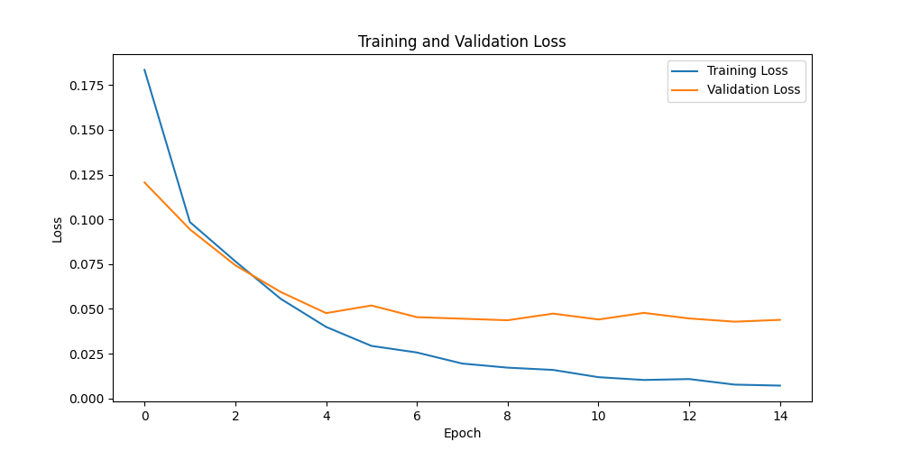
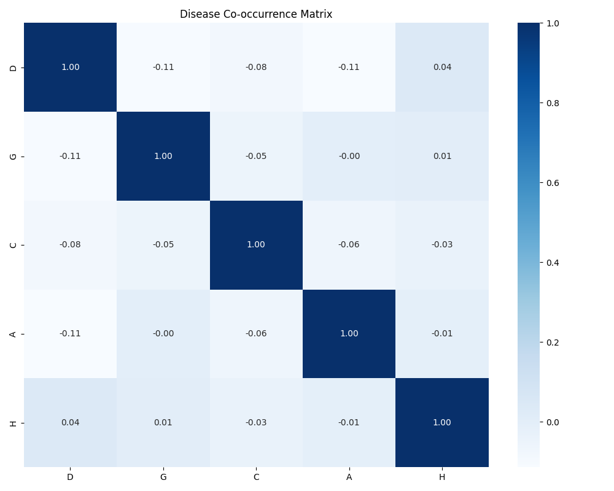
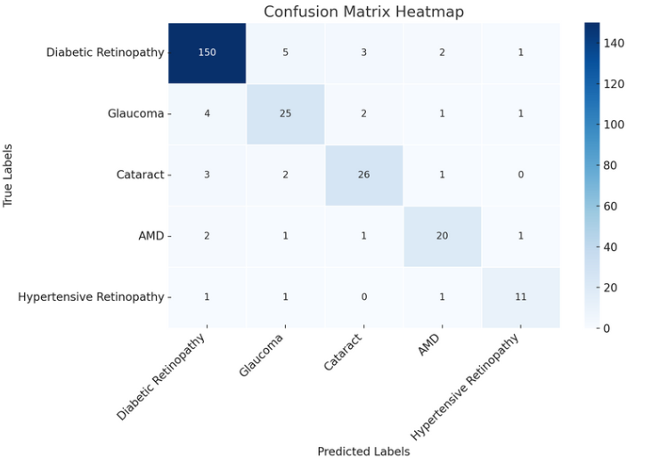
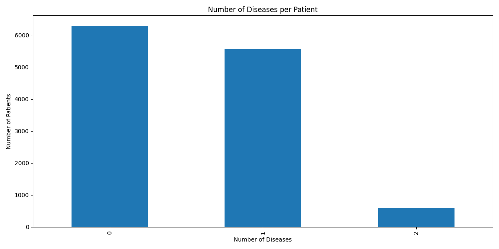
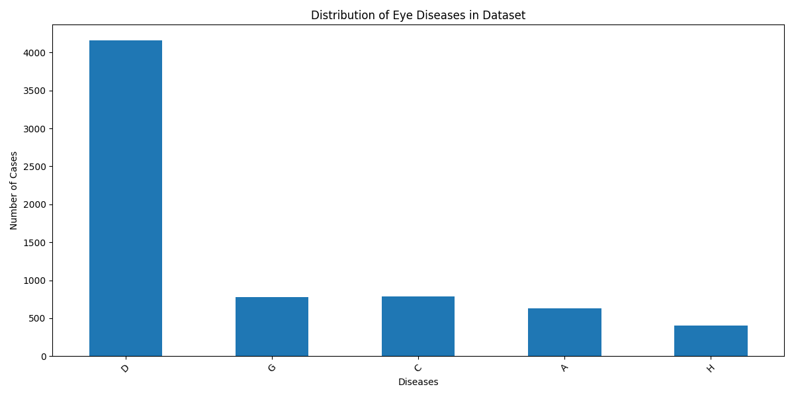
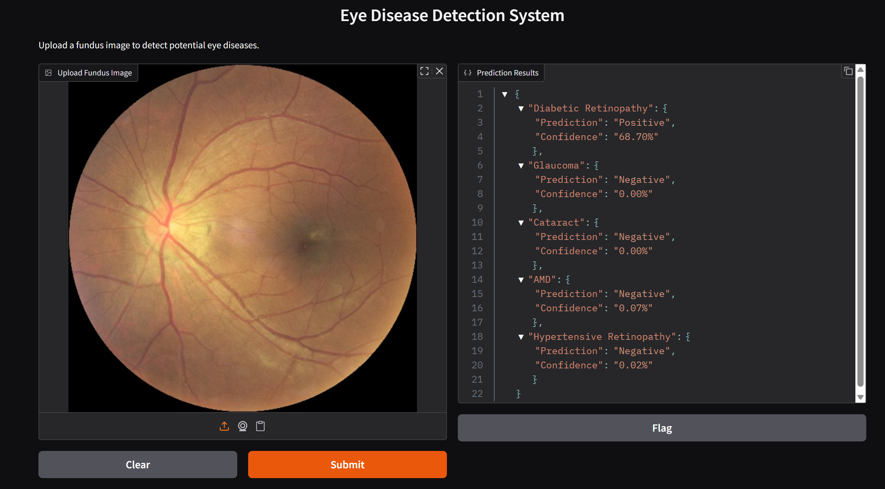

# Multi-Ocular Disease Detection from Fundus Images

This project aims to develop a deep learning-based diagnostic system to detect five common eye diseases (Diabetic Retinopathy, Glaucoma, Cataract, Age-related Macular Degeneration, Hypertensive Retinopathy) from fundus (retina) images. Using the ODIR-5K dataset, an EfficientNet-B0 architecture with transfer learning is designed for multi-label classification. The system addresses clinical challenges such as class imbalance, disease overlaps, and limited data, aiming to provide fast and integrated diagnosis in hospitals. The project combines medical imaging with artificial intelligence to improve early detection rates and prevent blindness.

---

## 1. Objectives and Approach

### **Objectives**
- Simultaneously detect D, G, C, A, and H diseases from a single fundus image
- Address class imbalance, especially for rare diseases
- Achieve high performance using Precision, Recall, F1 Score, and mAP metrics
- Provide a user-friendly demo interface with Gradio

### **Approach**
- Adapt the ImageNet-pretrained EfficientNet-B0 model using transfer learning for accurate and rapid results with small datasets
- Enhance model generalization through data augmentation techniques
- Use class-weighted loss to handle imbalanced data


## 2. Dataset and Preprocessing

- **Dataset:** https://www.kaggle.com/datasets/andrewmvd/ocular-disease-recognition-odir5k
- **Total Images:** 7,120 fundus images (from 3,560 patients, both left and right eyes)
- **Used Labels:** D, G, C, A, H
- **Excluded Labels:** Normal (N), Myopia (M), Other Abnormalities (O)
  - **Normal (N):** Some samples labeled as "normal" contain minor abnormalities, reducing label reliability.
  - **Myopia (M):** Early-stage myopia lacks distinctive visual markers in fundus images, making it hard to classify reliably.
  - **Other Abnormalities (O):** This class is highly heterogeneous, containing diverse and inconsistent samples, which complicates learning.
- **Cleaning:** Images with missing labels or resolution <224x224 pixels were removed
- **Averaging:** Left and right eye images were averaged pixel-wise to produce 5,000 single images
- **Split:** Training (80%, 4,000), Validation (10%, 500), Test (10%, 500)
- **Class Distribution:** D (32.2%), G (6.1%), C (6.1%), A (4.7%), H (2.9%)
- **Class Weights:** Rare classes were given higher weights (e.g., H: 1.0, A: 0.638)
- **Data Augmentation:** Applied using Albumentations (RandomHorizontalFlip, RandomRotation up to 10°, ColorJitter, ImageNet normalization)
- **Labels:** 5-dimensional binary vectors representing the presence/absence of each disease

---

## 3. Deep Learning Architecture

- **Model:** EfficientNet-B0 (transfer learning, ImageNet pretrained)
- **Contributions:** Dropout and Global Average Pooling prevent overfitting; sigmoid output enables multi-label classification
- **Advantage:** Lightweight and fast, suitable for mobile/clinical devices

---

## 4. Training Configuration

- **Optimizer:** Adam (lr=0.001)
- **Loss:** BCEWithLogitsLoss (class weights: [0.097, 0.517, 0.510, 0.638, 1.0])
- **Batch Size:** 16
- **Epochs:** Maximum 15 (early stopping enabled)
- **Hardware:** CUDA-enabled GPU preferred (falls back to CPU if unavailable)
- **Early Stopping:** Training stops if validation loss does not improve

---

## 5. Model Performance

### **Training Process – Loss Values**

| Epoch | Training Loss | Validation Loss |
|-------|--------------|----------------|
| 1     | 0.1834       | 0.1206         |
| 5     | 0.0399       | 0.0476         |
| 10    | 0.0159       | 0.0473         |
| 15    | 0.0071       | 0.0439         |

- Both training and validation loss decrease steadily, with no overfitting observed.

### **Loss Curve**
Both training and validation loss decrease steadily, with no overfitting observed.



### **Co-occurrence Matrix**
The co-occurrence of diseases is visualized below. For example, diabetic retinopathy and hypertension often co-occur.



### **Confusion Matrix**
The overall confusion matrix for all diseases is shown below. This matrix summarizes the model's performance across all classes in a single image, making it easy to interpret true/false positives and negatives for each disease.



### **Disease Combinations**
Below is the visualization of disease combinations in the dataset.



### **Disease Distribution**
Below is the class distribution of the dataset.



### **Model Evaluation Results**

- **Precision:** 0.9756
- **Recall:** 0.8904
- **F1 Score:** 0.9292
- **Mean Average Precision:** 0.8897

---

## 6. User Interface

- **Gradio Demo:**  
  To get instant predictions by uploading a fundus image:
  ```bash
  cd src
  python demo.py
  ```
  The interface will display predictions and probabilities for each disease.

  Below is an example of the Gradio-based user interface:

  

---

## 7. Model Weights

- Download the trained EfficientNet-B0 model directly:
  [EfficientNet-B0 Model (.pth) - Google Drive](https://drive.google.com/file/d/1fFyGo-wq4LsmqD-Pz32gfFICql9Jrnfm/view?usp=drive_link)
- Place the downloaded file in the `outputs/` directory.

---

## 8. Directory Structure

```
eye_disease_detection/
├── data/
│   ├── ODIR-5K/
│   │   ├── ODIR-5K/
│   │   │   ├── Training Images/
│   │   │   ├── Testing Images/
│   │   │   └── data.xlsx
│   │   ├── test/
│   │   │   ├── left/
│   │   │   └── right/
│   │   ├── train/
│   │   │   ├── left/
│   │   │   └── right/
│   │   ├── preprocessed_images/
│   │   └── cleaned_data.xlsx
│   └── full_df.csv
├── outputs/
│   ├── best_efficientnet_b0.pth
│   ├── confusion_matrix.png
│   ├── efficientnet_b0_training_history.png
│   ├── co_occurrence_matrix.png
│   ├── disease_combinations.png
│   ├── disease_distribution.png
│   ├── gradio_demo.png
│   └── ...
├── src/
│   ├── __init__.py
│   ├── analyze_dataset.py
│   ├── dataset.py
│   ├── demo.py
│   ├── generate_report.py
│   ├── model.py
│   ├── train.py
│   ├── utils.py
│   └── ...
├── main.py
├── preprocess_dataset.py
├── requirements.txt
└── ...
```

---

## 9. Installation & Usage

1. **Install requirements:**
   ```bash
   pip install -r requirements.txt
   ```
2. **Prepare your dataset:**  
   Place `data/cleaned_data.xlsx` and fundus images in `data/ODIR-5K/`.
3. **Train and test the model:**
   ```bash
   python main.py
   ```
4. **Launch the Gradio interface:**
   ```bash
   cd src
   python demo.py
   ```

---

## 10. Future Work

- Train with larger datasets and more disease classes
- Apply visual interpretation techniques (e.g., Grad-CAM) for explainability
- Collect more patient data and expand validation for clinical accuracy

---

## 11. Conclusion

This EfficientNet-B0-based system detects multiple eye diseases from fundus images with high accuracy. Transfer learning and class weighting address data imbalance, and the Gradio interface provides a practical solution for clinical use.


